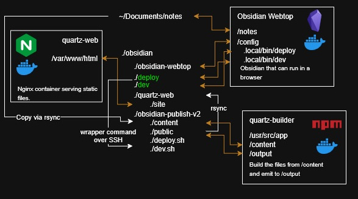
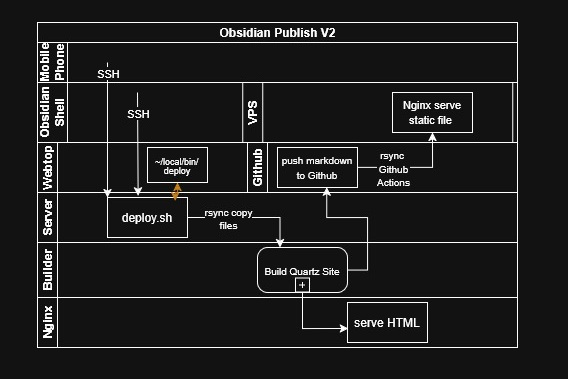

> Old: https://vttc08.github.io/obsidian-notes
> New: https://vttc08.github.io/obsidian-notes-v2
> Repo: https://github.com/vttc08/obsidian-notes-v2
> Also on [Cloudflare Pages](https://obsidian-notes-v2-7tt.pages.dev/)
> 	[VPS Deployment](https://dg.freetier.giize.com/)


## Current Issues
My previous [obsidian-publish](obsidian-publish.md) implementation has several limitations that need addressing:
### Publishing Constraints
- **Single-device dependency**: Publishing only works from my desktop with specific Windows/PowerShell setup
- **Complex environment requirements**: Requires NodeJS, Quartz, correct Git repo location, and SMB share access, which is complex to setup on new devices
- **Platform limitations**: No support for non-Windows devices, mobile phones, or shared computers
### Technical Issues
- **File handling**: Copy scripts don't handle file deletions properly
- **No live preview**: Local server serves as the only preview method
- **Date metadata loss**: GitHub Pages builds lose filesystem dates since I don't use frontmatter, causing incorrect "recent notes" ordering
- **Fragile workflow**: Entire process breaks if desktop is unavailable or environment changes

These limitations make note publishing inflexible and unreliable, especially when away from my primary desktop setup.
## Proposed Plans
To address these limitations, I'm rebuilding the publishing workflow with server-side processing using Docker and SSH for universal access.

**Core Architecture:**
- **Server-side publishing**: All build processes run on a dedicated Linux server with Docker
- **Universal access**: Any device with SSH or web browser can trigger publishing
- **Docker containerization**: Handles NodeJS/Quartz environment without local dependencies
**Access Methods:**
1. **SSH command**: Simple one-liner from any terminal: `ssh server "deploy.sh"`
2. **Obsidian Shell**: Direct integration for desktop publishing
3. **Web-based terminal**: Using [webtop](https://docs.linuxserver.io/images/docker-obsidian/) Docker container for browser-based access
4. **Mobile SSH**: Terminal apps for mobile publishing

**Key Benefits:**
- **Device independence**: No platform-specific requirements
- **Always available**: Server runs 24/7, no desktop dependency
- **Simplified setup**: Single server configuration vs. per-device setup
- **Reliable workflow**: Containerized environment prevents configuration drift

The webtop solution provides a full Obsidian environment in browsers, though mobile KasmVNC is unusable, but SSH terminal access works fine.


## Quartz
The setup and customization of Quartz has been the same, here are the summary.
### Installation
Install NodeJS and Quartz. I opted to install it in WSL rather than Windows itself to mimic a Linux environment. The instructions for [starting with Quartz](https://quartz.jzhao.xyz/#-get-started).
### Changes
Added my own list of notes to ignore. There are 2 ignore types in Quartz, and adding notes to both is nessecary
- `.gitignore`: repository, it will prevent the file from tracked by git
- `quartz.config.ts`: quartz, quartz will not build the website for these notes
[List spacing plugin](https://github.com/vttc08/obsidian-notes-v2/commit/69480ead9818a5185a4e1fdbe99086f1bfd00354#diff-4a1136faedf6c078a373a8bedf078747b603320ba47dd064c4731b6d00bf1a0b)
- by default, even using `HardLineBreak`, there are some issues with how Obsidian and Quartz looks with line breaks after a markdown list.

[Display Recent Notes on Home Page](https://github.com/vttc08/obsidian-notes-v2/commit/28ae4c8b6973bed101993ed7103dd45c9d285804)
- I used CSS flex properties to have the homepage display a responsive layout with multiple columns


## Deployment Issues
I used the [official recommended method](https://quartz.jzhao.xyz/hosting#github-pages) to publish to Github pages, with a [custom Github action](https://github.com/vttc08/obsidian-notes-v2/commit/3afbc0b57e3fef7748362eee91d5d7b8489fd9ba#diff-28802fbf11c83a2eee09623fb192785e7ca92a3f40602a517c011b947a1822d3) that copies built HTML to my VPS for CI/CD demonstration. For home server deployment, I copy build output to an Nginx folder integrated with my existing reverse proxy.
### Date Issue
Recent notes display randomly on Github Pages and VPS, but correctly on my home server. Since I don't use frontmatter dates, Quartz relies on filesystem timestamps, which are lost when committing to Github, everything inherits the commit date instead of original modification time.

Rather than retrofitting frontmatter dates across all notes, I solved this using [ghp-import](https://pypi.org/project/ghp-import/) to build locally with preserved filesystem dates, then push static HTML to the `gh-pages` branch for both Github and Cloudflare Pages to serve.
### Docker Issue
Testing the [official Quartz image](https://github.com/jackyzha0/quartz/pkgs/container/quartz), I came across several challenges. Using `user: ${PUID}:${PGID}` for proper file ownership caused errors, requiring [this patch](https://github.com/vttc08/obsidian-notes-v2/commit/ebaac7fe3536197eadb53a857e0bfe377409cf4b). 

Yet this only worked on WSL, because my bind mount consists of `node_modules`. On my Linux server, bind mounting overwrote the container's `node_modules` with my empty host directory, breaking dependencies. Without bind mounting, the `user` directive failed as source code became root-owned. The solution: run as root and use `chown -R $PUID:$PGID` on the `public` folder afterward.
### What Didn't Work
The webtop image came with Docker command preinstalled, I thought I could run my Docker commands directly. By default, the Docker socket is not expose to the container, but using [docker-socket-proxy](https://docs.linuxserver.io/images/docker-socket-proxy/#docker-cli-click-here-for-more-info), I was able to safely expose Docker to webtop. However, Docker parses compose file locally, relative paths such as `./` or `~/` would resolve to the path in the container, rather than the host.

## My Architecture
So what is the architecture that balances all the compromises. Here is the tree structure.
```
├── obsidian-notes-v2/
│   ├── compose.yml
│   ├── deploy.sh
│   ├── dev.sh
│   ├── Dockerfile
│   ├── content/
│   ├── public/
│   ├── quartz/
│   │   ├── <project_source_code>
│   ├── quartz.config.ts
│   ├── quartz.layout.ts
├── obsidian-webtop/
│   ├── compose.yml
│   ├── deploy
│   ├── dev
│   ├── Documents/
│   │   └── ssh/
│   │       └── openssh_keys/
└── quartz-web/
    ├── site/
    ├── compose.yml
    └── nginx.conf

```
In the master `obsidian` folder, I have 3 folder
- `obsidian-note-v2` - git repo where it keep tracks of source code related changes, as well as the working directory for deployment related tasks
- `obsidian-webtop` - project folder for Docker obsidian webtop
- `quartz-web` - Nginx docker container for serving static files

There are few possible ways to trigger deployment
- by using obsidian-shell
- using webtop in a web browser, opening terminal and type `deploy`
- manually SSH into the server and running `deploy.sh` located in `obsidian-notes-v2`

In all cases, the `deploy.sh` is the entrypoint for everything. Here are the steps it occurs when `deploy.sh` is triggered
1. change into `obsidian-notes-v2` since all Docker and git repo related files are here
```bash
cd $(dirname ${BASH_SOURCE[0]})
```
2. run rsync command to copy my notes from my vault (also saved in Linux server) to `content/`, this step is needed so I can keep track of it using git, it deletes any files that was deleted in the vault
```bash
rsync -ahP --delete ~/Documents/notes/ ./content/
```
3. use Docker to run an ephemeral container and build the site using quartz, the container uses `content/` folder consisting of markdown files and generated static files in `public/`
```bash
docker compose run --rm quartz-builder
```
4. run `ghp-import` which automatically commit changes in `public/` into `gh-pages`
```bash
uv un ghp-import public/ -p
```
5. synchronize the files from `public/` into production Nginx folder
```bash
rsync -ahP --delete --remove-source-files ./public/ ../quartz-web/site/
```
6. git related tasks such as add, commit and push
### Docker Compose
The [compose file](https://github.com/vttc08/obsidian-notes-v2/blob/v4/compose.yml) does the heavy lifting when building the site. It consists of 3 sections
- `quartz-service` - general environment and information about the quartz container
- `quartz-builder` - building the HTML from markdown
- `quartz-dev` - development server

The compose file uses environment variables `QUARTZ_OUTPUT_DIR|CONTENT_DIR` so the `npx` command can be consistent, as well as `PUID/PGID` so the `chown` can ensure the emitted file are correct permission despite the container is running as root. The standardized configuration allows for flexibility, I simply have to change the bind mount, add optional read-only and the build will run stateless-ly.
### Dev Server
To sort out live preview, I've also added a dev server. It uses `--serve` to live preview the site. However, Websocket doesn't work, even though it works outside of Docker. To run it ephemerally as well as using port forwarding, this command is needed.
```bash
docker compose run --rm --name quartz-dev --service-ports quartz-dev
```

To add convenience into the webtop container. I've created `deploy` and `dev` in `obsidian-webtop/` which are simply wrappers for `deploy.sh` and `dev.sh` and SSH, then I used bind mount to `./deploy:/config/.local/bin`, so these scripts are in the container's shell `PATH`, and I can simply type `deploy` to execute the desired script over SSH. Similarly, in obsidian-shell, the command for deployment is much easier. Here's the original Powershell script
```bash
sleep 0.5
$dg = [Environment]::GetFolderPath("MyDocuments") + "\Projects\obsidian-publish"
function cpy{
  param ($src, $dest, $opt)
  robocopy $src $dest /E /NDL /NJH /XF *.py *.ipynb $opt
}
cpy . "$dg\content"
cd $dg
npx quartz build
cpy public/ "\\10.10.120.12\docker\quartz-web\site" /NFL
if (${{_github}}) { 
  npx quartz sync -m "${{_commit}}"
  echo "Published to github."
} else { echo "Process is done." }
```
And the updated script, which works on any computer
```bash
ssh -t laptopserver "~/docker/obsidian/obsidian-notes-v2/deploy.sh"
```

Here is a diagram showing the workflow, which may be easier to understand.

