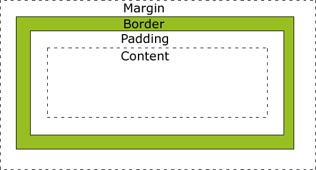

Everything HTML element is displayed as a box.

**Padding**
Spaces around an element's content, inside borders
```css
p {
	padding: 10px;
}
```
- one value specify same padding all around
- two value: first is top/bottom, second is left/right
- 4 values: clockwise order; top, right, bottom, left

**Margin**
Spaces around the element outside borders
- margins can be negative such that elements overlap
Margins have `auto` which allow elements to be centered
```css
h1 {
  margin: auto;
}
```

- however, it will not align vertically
**Borders**
```css
a { border: 1px solid red; } /* Shorthand syntax */
```
Border have 3 properties - width, style and color
- width are thin, medium, thick or in px 
- border styles (dash, solid, dot)
- https://developer.mozilla.org/en-US/docs/Web/CSS/border-style

**Box Sizing**
When this is applied to `content-box`
- width and height apply to the content box
- when border and paddings are added, it increase the content size
`border-box`
- width and height include everything
- when border and paddings are added, the content decrease

Border box is recommended because everything border
CSS snippet that apply the box sizing and inherit it for all the boxes
```css
html {
	box-sizing: border-box;
}
*, *:before, *:after {
	box-sizing: inherit;
}
```

**Inline and Block**
Width and height do not have effect on inline element, but it will change the size of block element. ^402f91
- inline box are displayed side by side while block are displayed in rows
- margin will change spaces around all side of block element but only left/right of inline element
- padding will add space to the content in all sides
	- with block, the blocks will shift around because of increased padding
	- with inline, it will overlap

```css
display: block or inline;
```
`display` will override the display style
`inline-block` will act similar to inline element as it will not force line-break, but it will cause other boxes to move away rather than overlap which is like a block